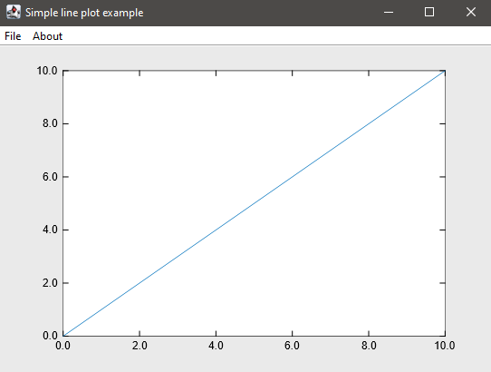
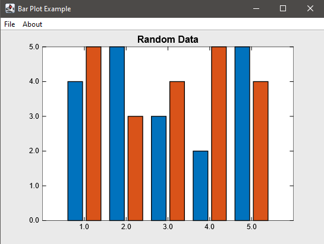
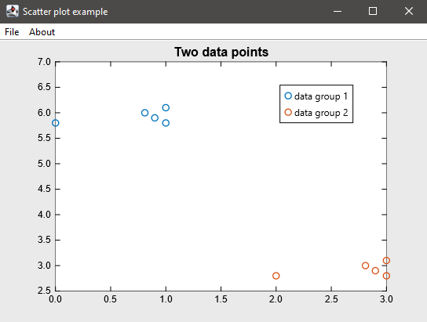

# UPlot

A MATLAB-like, easy-to-use scientific plot library in Java.

[](https://opensource.org/licenses/MIT)
[](https://img.shields.io)
[](https://openjfx.io/)

---

## Basic usage

UPlot makes use of an Embedded DSL like programming interface. Plots can be initialised from Java code or JShell and can be displayed either in a separate window, or embedded into JavaFX Panes.

The module can be used by itself in the JShell environment. To make this process easier, there is a setup.jsh JShell script file in the project root directory, that contains all the commands required to setup the shell environment and the imports for the Fluent Interface.
To use the script, edit the line starting with `/env -module-path`, by adding the path to the hu.virt.unipannon.plot.jar and the path to the javafx library jar files installed on your system separated by a semicolon `;`.
After this setup, open jshell and use the `/open setup.jsh` command. If the paths are incorrect, the shell will indicate it with exceptions. If no errors are present, the plotting functions are all imported and you can start plotting right away.

The jar file contains the hu.unipannon.virt.plot module that can be used as a library for any Java 11 project. Consult your IDE's manual on how to achieve that. 

## Examples

- Simple line plot

```java
import hu.unipannon.virt.plot.fluent.Figure;
import hu.unipannon.virt.plot.fluent.Plot;
import hu.unipannon.virt.plot.fluent.Line;

import static hu.unipannon.virt.plot.fluent.Figure.figure;
import static hu.unipannon.virt.plot.fluent.Plot.plot;
import static hu.unipannon.virt.plot.fluent.Line.line;

public class SimpleLinePlot {
    public static void main(String[] args) {
        var xs = new double[] {0.0, 1.0, 2.0, 3.0, 4.0, 5.0, 6.0, 7.0, 8.0, 9.0, 10.0};
        var ys = new double[] {0.0, 1.0, 2.0, 3.0, 4.0, 5.0, 6.0, 7.0, 8.0, 9.0, 10.0};
        var fig = figure()
            .title("Simple line plot example")
            .plot(line(xs, ys));
        
        fig.show();
    }
}
```



- Bar plot

```java
import hu.unipannon.virt.plot.fluent.Figure;
import hu.unipannon.virt.plot.fluent.Bar;
import hu.unipannon.virt.plot.fluent.Category;
import hu.unipannon.virt.plot.fluent.FrameStyle;

import static hu.unipannon.virt.plot.fluent.Figure.figure;
import static hu.unipannon.virt.plot.fluent.Bar.bar;
import static hu.unipannon.virt.plot.fluent.FrameStyle.title;
import static hu.unipannon.virt.plot.fluent.Category.category;

public class BarPlot {
    public static void main(String[] args) {
        var ys1 = new double[] {4.0, 5.0, 3.0, 2.0, 5.0};
        var ys2 = new double[] {5.0, 3.0, 4.0, 5.0, 4.0};

        var fig = figure()
            .title("Bar Plot Example")
            .bar(
                title("Random Data")
                , category()
                    .series(ys1)
                    .series(ys2));
        
        fig.show();
    }    
}
```



- Scatter plot

```java
import hu.unipannon.virt.plot.fluent.Figure;
import hu.unipannon.virt.plot.fluent.FrameStyle;
import hu.unipannon.virt.plot.fluent.Scatter;
import hu.unipannon.virt.plot.fluent.Series;

import static hu.unipannon.virt.plot.fluent.Figure.figure;
import static hu.unipannon.virt.plot.fluent.FrameStyle.title;
import static hu.unipannon.virt.plot.fluent.Scatter.scatter;
import static hu.unipannon.virt.plot.fluent.Series.series;


public class ScatterPlot {

    public static void main(String[] args) {
        
        var xs1 = new double[] {0.0, 0.81, 0.9, 1.0, 1.0};
        var ys1 = new double[] {5.8, 6.0, 5.9, 5.8, 6.1};

        var xs2 = new double[] {2.0, 2.81, 2.9, 3.0, 3.0};
        var ys2 = new double[] {2.8, 3.0, 2.9, 2.8, 3.1};

        var fig = figure()
            .title("Scatter plot example")        
            .scatter(
                title("Two data points")
                .legend("data group 1", "data group 2")
                , series(xs1, ys1)
                , series(xs2, ys2));
        
        fig.show();
    }
    
}
```

